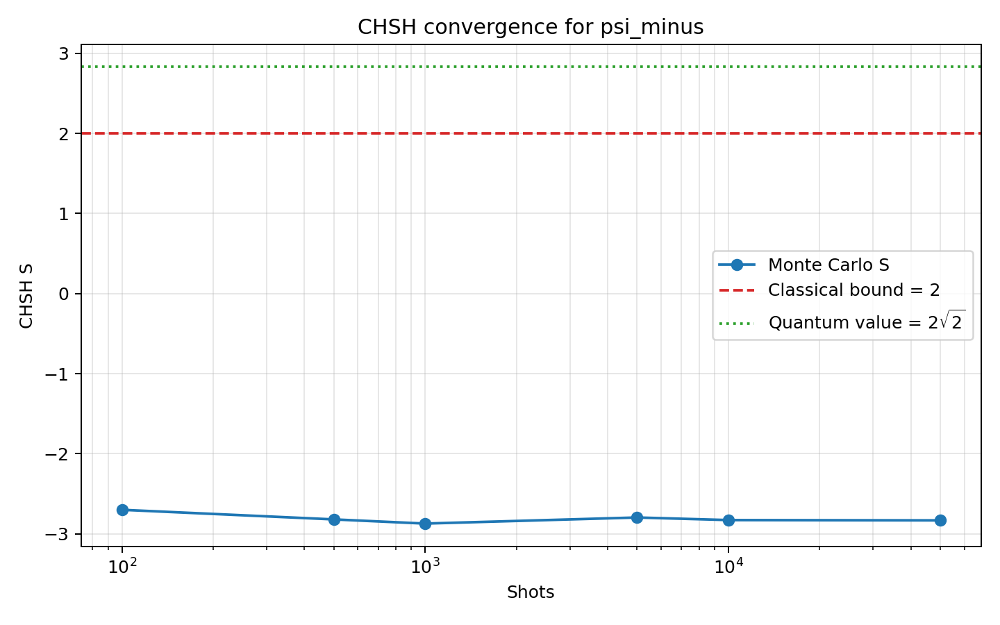
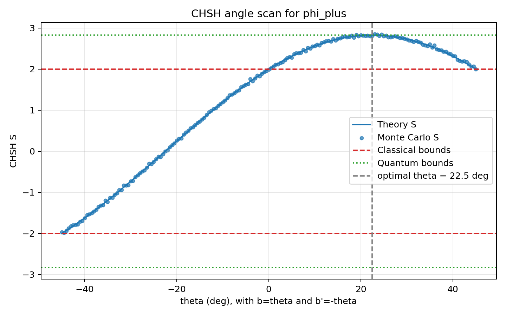
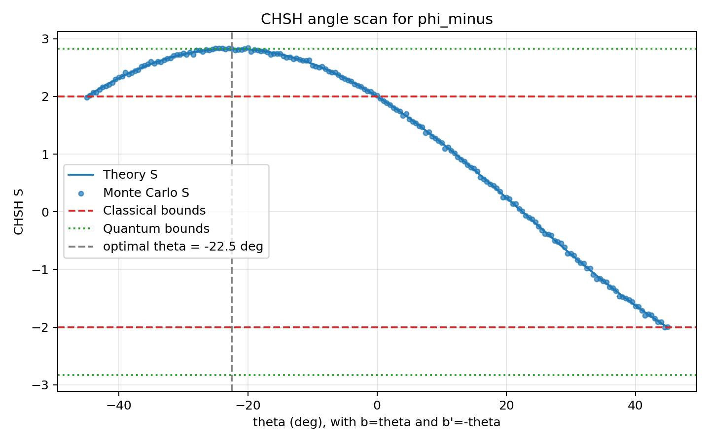
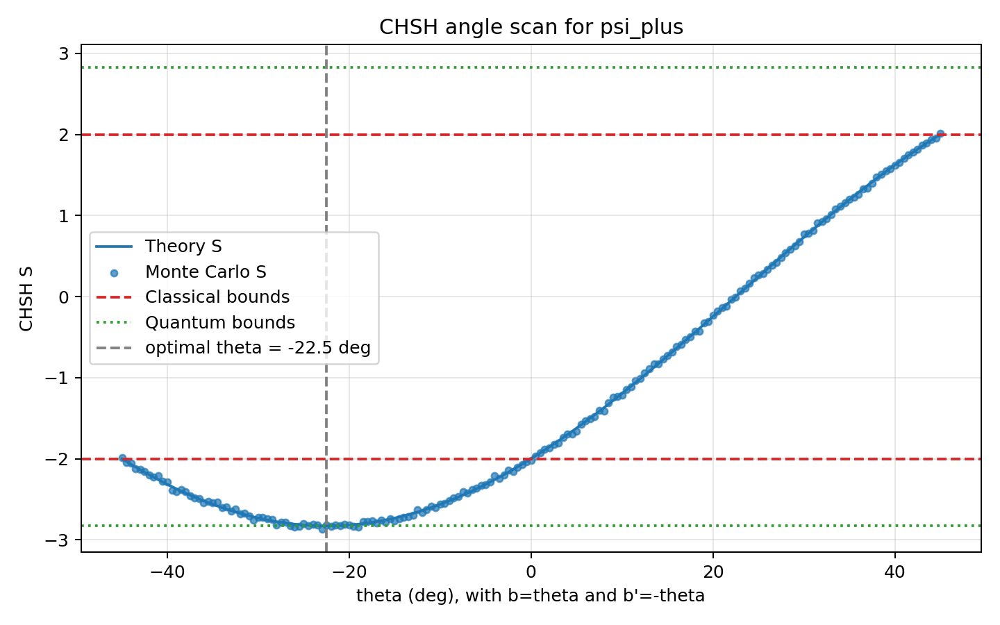
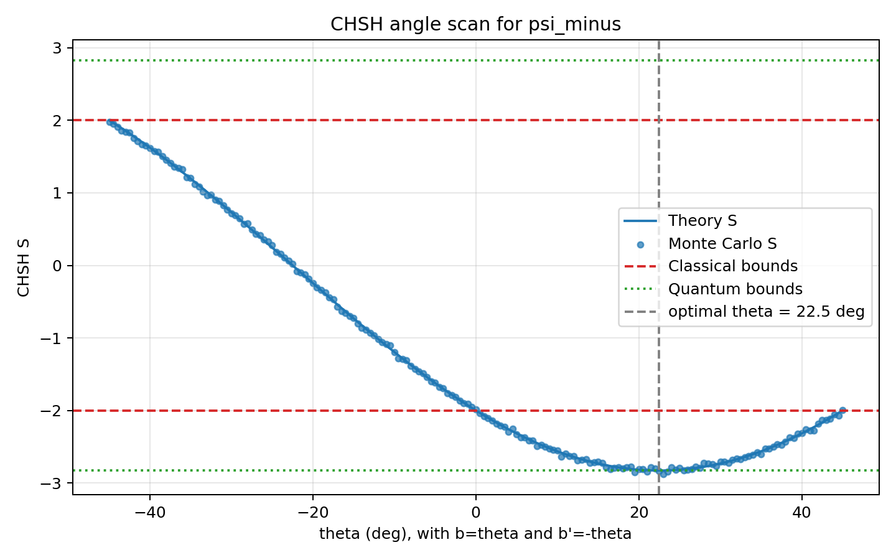
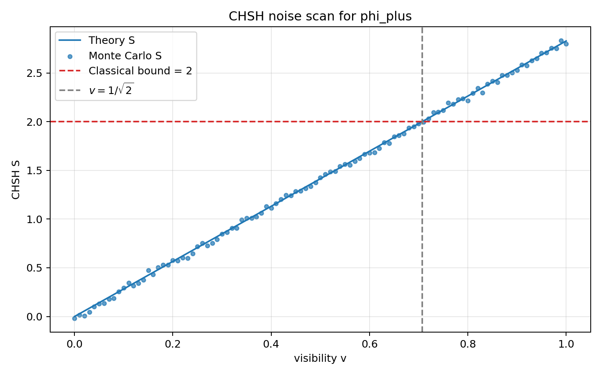

# 双比特量子纠缠制备与 CHSH 不等式违背的蒙特卡洛验证

## 摘要

本项目以双比特 Bell 态为对象，利用量子态模拟和 Monte Carlo 抽样验证 CHSH 不等式的违背。仿真采用逐 shot 投影测量：每次重新制备纠缠态，按给定测量角依次测量 Alice 和 Bob，并由有限 shots 计数估计关联期望值 \(E\) 和 CHSH 参数 \(S\)。结果表明，在合适测量角下，\(|\Phi^+\rangle\) 的模拟结果满足 \(|S|>2\)，并接近量子理论值 \(2\sqrt{2}\)。项目还比较了四个 Bell 态的关联结构，并通过角度扫描和 visibility 噪声模型分析 CHSH 违背的影响因素。

# 第一章 引言

## 1.1 研究背景

量子纠缠是量子信息中的基本现象。对于双粒子纠缠态，单个粒子的测量结果仍具有随机性，但两个粒子的联合测量结果可以表现出强关联。EPR 佯谬指出，这种远距离关联与经典定域实在论难以协调：如果物理量在测量前已有确定值，且远处测量选择不能影响本地结果，那么纠缠关联应当能够由局域隐变量解释。

Bell 不等式将这一问题转化为可检验的统计判据。若实验关联满足 Bell 不等式，局域隐变量模型仍可能成立；若实验关联违反 Bell 不等式，则说明经典定域模型无法解释该系统的统计结果。CHSH 不等式是 Bell 不等式最常用的双粒子二值测量形式。

## 1.2 实验目标

本实验围绕 CHSH 验证展开，主要目标如下：

1. 制备四种双比特 Bell 态。

2. 在不同测量基下模拟有限 shots 重复测量。

3. 由测量计数估计关联期望值 \(E\)，并计算 CHSH 参数 \(S\)。

4. 验证合适测量角下的量子结果满足

$$
|S|>2,
$$

并接近最大量子值

$$
|S|=2\sqrt{2}.
$$

5. 通过角度扫描、不同 Bell 态比较和噪声模型，分析 CHSH 违背的影响因素。

# 第二章 CHSH 实验原理

## 2.1 实验设置

CHSH 实验包含两个测量方 Alice 和 Bob。一对粒子分别发送给两端，Alice 可选择测量设置 \(a\) 或 \(a'\)，Bob 可选择测量设置 \(b\) 或 \(b'\)。每次实验中，两端各选择一个设置并得到二值结果：

$$
A\in\{+1,-1\},\quad B\in\{+1,-1\}.
$$

大量重复实验后，可以分别统计四组测量设置

$$
(a,b),\quad (a,b'),\quad (a',b),\quad (a',b')
$$

下的联合结果分布，并由此计算统计关联。

## 2.2 关联函数 \(E\)

对测量设置 \((x,y)\)，其中 \(x\in\{a,a'\}\)，\(y\in\{b,b'\}\)，四种联合结果概率记为

$$
P_{++},\quad P_{+-},\quad P_{-+},\quad P_{--}.
$$

关联函数定义为

$$
E(x,y)=P_{++}+P_{--}-P_{+-}-P_{-+}.
$$

等价地，若将两端结果相乘，则

$$
E(x,y)=\langle AB\rangle.
$$

因此，\(E=1\) 表示完全正相关，\(E=-1\) 表示完全反相关，\(E=0\) 表示没有净相关。

## 2.3 CHSH 参数 \(S\)

CHSH 参数定义为

$$
S=E(a,b)+E(a,b')+E(a',b)-E(a',b').
$$

单个关联函数的取值范围为 \([-1,1]\)，不足以区分经典关联和量子纠缠关联。CHSH 判据的关键在于：对任何定域隐变量模型，上述四项组合必须满足

$$
|S|\leq 2.
$$

若实验得到

$$
|S|>2,
$$

则该统计结果不能由定域隐变量模型解释。

## 2.4 经典上界的推导

设每对粒子携带隐变量 \(\lambda\)。在定域隐变量理论中，Alice 的结果只依赖本地设置和 \(\lambda\)，Bob 的结果也只依赖本地设置和 \(\lambda\)。因此对固定的 \(\lambda\)，四个可能结果

$$
A(a,\lambda),\quad A(a',\lambda),\quad B(b,\lambda),\quad B(b',\lambda)
$$

均已确定，且只取 \(\pm1\)。

对固定 \(\lambda\)，CHSH 组合为

$$
S(\lambda)
=A(a,\lambda)B(b,\lambda)
+A(a,\lambda)B(b',\lambda)
+A(a',\lambda)B(b,\lambda)
-A(a',\lambda)B(b',\lambda).
$$

整理得

$$
S(\lambda)
=A(a,\lambda)\left[B(b,\lambda)+B(b',\lambda)\right]
+A(a',\lambda)\left[B(b,\lambda)-B(b',\lambda)\right].
$$

由于 \(B(b,\lambda),B(b',\lambda)\in\{+1,-1\}\)，两个括号中一个为 \(0\)，另一个为 \(\pm2\)。于是

$$
|S(\lambda)|=2.
$$

实验观测值是对隐变量分布 \(\rho(\lambda)\) 的平均：

$$
S=\int \rho(\lambda)S(\lambda)\,d\lambda.
$$

因此

$$
|S|
=\left|\int \rho(\lambda)S(\lambda)\,d\lambda\right|
\leq \int \rho(\lambda)|S(\lambda)|\,d\lambda
\leq 2.
$$

这就是 CHSH 不等式。它给出了所有定域隐变量模型共同满足的经典上界。

## 2.5 量子力学预言

量子力学允许纠缠态在合适测量设置下违反 CHSH 不等式。对于最大纠缠双比特态，CHSH 参数可达到

$$
|S|_{\max}=2\sqrt{2},
$$

该值称为 Tsirelson 上界。它高于经典上界 \(2\)，说明量子纠缠可以产生强于经典定域模型允许范围的统计关联。

# 第三章 量子模型与测量约定

## 3.1 Bell 态

双比特计算基取为

$$
|00\rangle,\quad |01\rangle,\quad |10\rangle,\quad |11\rangle.
$$

四个 Bell 态定义为

$$
|\Phi^\pm\rangle=\frac{|00\rangle\pm|11\rangle}{\sqrt{2}},
$$

$$
|\Psi^\pm\rangle=\frac{|01\rangle\pm|10\rangle}{\sqrt{2}}.
$$

主实验使用

$$
|\Phi^+\rangle=\frac{|00\rangle+|11\rangle}{\sqrt{2}}.
$$

在线路模型中，\(|\Phi^+\rangle\) 可由 \(|00\rangle\) 经 Hadamard 门和 CNOT 门制备：

$$
|00\rangle
\xrightarrow{H\otimes I}
\frac{|00\rangle+|10\rangle}{\sqrt{2}}
\xrightarrow{\mathrm{CNOT}}
\frac{|00\rangle+|11\rangle}{\sqrt{2}}.
$$

其余 Bell 态可由 \(|\Phi^+\rangle\) 施加局域 Pauli 门得到。

## 3.2 偏振测量基

本文采用偏振光子测量角约定。角度为 \(\theta\) 的测量基为

$$
|+_\theta\rangle=\cos\theta|0\rangle+\sin\theta|1\rangle,
$$

$$
|-_\theta\rangle=-\sin\theta|0\rangle+\cos\theta|1\rangle.
$$

该约定下，对 \(|\Phi^+\rangle\) 有

$$
E(\theta_A,\theta_B)=\cos[2(\theta_A-\theta_B)].
$$

因此最优 CHSH 角为

$$
a=0^\circ,\quad a'=45^\circ,\quad b=22.5^\circ,\quad b'=-22.5^\circ.
$$

此时

$$
S=2\sqrt{2}.
$$

这里的因子 \(2\) 来自偏振角表示，因此不能直接套用自旋 \(1/2\) 约定下的角度。

## 3.3 visibility 噪声模型

为模拟态制备误差、退相干或混合态污染，本文采用 visibility 混合模型：

$$
\rho_v=v|\Phi^+\rangle\langle\Phi^+|+(1-v)\frac{I_4}{4},
\quad 0\leq v\leq1.
$$

完全混合态不贡献净关联，因此最优角度下有

$$
S(v)=2\sqrt{2}v.
$$

CHSH 违背条件为

$$
v>\frac{1}{\sqrt{2}}\approx0.707.
$$

## 3.4 仿真中的测量约定

每个 shot 对应一次独立实验。仿真中先重新制备双比特态 \(\rho\)，再按给定角度进行投影测量。

对单比特测量角 \(\theta\)，先定义单比特投影算符

$$
P_+(\theta)=|+_\theta\rangle\langle+_\theta|,
\quad
P_-(\theta)=|-_\theta\rangle\langle-_\theta|.
$$

由于 \(\rho\) 是双比特密度矩阵，实际测量时需要将单比特投影算符扩展到双比特空间。测量 Alice 时使用

$$
\Pi_r^A=P_r(\theta_A)\otimes I,
$$

测量 Bob 时使用

$$
\Pi_r^B=I\otimes P_r(\theta_B).
$$

若当前使用的双比特投影算符记为 \(\Pi_r\)，测量结果 \(r\in\{+,-\}\) 的概率由 Born rule 给出：

$$
p_r=\mathrm{Tr}(\Pi_r\rho).
$$

若得到结果 \(r\)，测量后的态更新为

$$
\rho'=\frac{\Pi_r\rho\Pi_r}{\mathrm{Tr}(\Pi_r\rho)}.
$$

本项目每个 shot 先测 Alice，再测 Bob，并记录联合结果。Alice 和 Bob 的投影算符作用在不同量子比特上，因此该计算顺序不改变联合测量的理论统计结果。

# 第四章 程序实现

## 4.1 实现流程

程序使用 NumPy 完成双比特态模拟，主要步骤为：

1. 制备 Bell 态，并写成密度矩阵。

2. 根据 visibility 加入白噪声混合。

3. 对每组测量角执行逐 shot 投影测量。

4. 由计数估计 \(E_{\mathrm{sim}}\)。

5. 由 Born 概率计算 \(E_{\mathrm{theory}}\) 作为理论参考。

6. 由四组 \(E\) 组合得到 \(S_{\mathrm{sim}}\) 和 \(S_{\mathrm{theory}}\)。

核心计算位于 `src/chsh.py`，命令行入口和绘图位于 `src/main.py`。

## 4.2 逐 shot 投影测量

对一组角度 \((\theta_A,\theta_B)\)，程序重复执行 \(N\) 次独立 shot。每次 shot 的流程为：

1. 复制当前待测密度矩阵。

2. 构造 Alice 的投影算符 \(P_+^A,P_-^A\)，随机得到 Alice 结果。

3. 按投影测量规则更新双比特态。

4. 构造 Bob 的投影算符 \(P_+^B,P_-^B\)，随机得到 Bob 结果。

5. 将联合结果计入 \(N_{++},N_{+-},N_{-+},N_{--}\)。

有限 shots 下的关联函数估计为

$$
\hat{E}
=\frac{N_{++}+N_{--}-N_{+-}-N_{-+}}{N}.
$$

这一过程用于生成 \(E_{\mathrm{sim}}\)。理论值 \(E_{\mathrm{theory}}\) 仍由联合 Born 概率计算，不参与随机抽样。

## 4.3 实验设计

本项目包含四类实验：

1. 默认 CHSH 实验：使用 \(|\Phi^+\rangle\) 和最优偏振角，验证 \(|S|>2\)。

2. shots 收敛实验：改变 shots 数，观察 \(\hat{S}\) 向理论值收敛。

3. 角度扫描实验：固定 \(a=0^\circ,a'=45^\circ,b=\theta,b'=-\theta\)，扫描 \(\theta\)。

4. 噪声扫描实验：扫描 visibility \(v\)，观察 CHSH 违背随噪声增强而消失。

# 第五章 实验结果与分析

## 5.1 默认 CHSH 实验

默认实验使用 \(|\Phi^+\rangle\)、shots \(=10000\)，测量角为

$$
a=0^\circ,\quad a'=45^\circ,\quad b=22.5^\circ,\quad b'=-22.5^\circ.
$$

四组关联期望值如下：

| 测量组合 | \(E_{\mathrm{sim}}\) | \(E_{\mathrm{theory}}\) | 误差 |
|---|---:|---:|---:|
| \(E(a,b)\) | 0.710400 | 0.707107 | 0.003293 |
| \(E(a,b')\) | 0.704800 | 0.707107 | -0.002307 |
| \(E(a',b)\) | 0.723000 | 0.707107 | 0.015893 |
| \(E(a',b')\) | -0.704600 | -0.707107 | 0.002507 |

由此得到

$$
S_{\mathrm{sim}}=2.842800,\quad
S_{\mathrm{theory}}=2.828427.
$$

模拟结果超过经典上界 \(2\)，并接近 \(2\sqrt{2}\)，说明 \(|\Phi^+\rangle\) 在该测量设置下违反 CHSH 不等式。

## 5.2 shots 收敛实验

改变 shots 数得到以下结果：

| shots | \(S_{\mathrm{sim}}\) | \(S_{\mathrm{theory}}\) | 误差 |
|---:|---:|---:|---:|
| 100 | 2.760000 | 2.828427 | -0.068427 |
| 500 | 2.768000 | 2.828427 | -0.060427 |
| 1000 | 2.894000 | 2.828427 | 0.065573 |
| 5000 | 2.844400 | 2.828427 | 0.015973 |
| 10000 | 2.815000 | 2.828427 | -0.013427 |
| 50000 | 2.820640 | 2.828427 | -0.007787 |

各 shots 设置下均有 \(S_{\mathrm{sim}}>2\)。需要注意，\(2\sqrt{2}\) 是无限重复测量下理论期望值的上界，而 \(S_{\mathrm{sim}}\) 是有限 shots 频率估计量。有限样本会使估计值围绕理论值波动，因此个别点可能略高于 \(2\sqrt{2}\)，例如 1000 shots 时的 \(S_{\mathrm{sim}}=2.894000\)。这不表示 Tsirelson 上界被突破；随着 shots 增加，结果应逐渐收敛到理论值附近。

## 5.3 四个 Bell 态的比较

在同一组默认测量角下，四个 Bell 态的 CHSH 理论值不同。表中 `Phi+`、`Phi-`、`Psi+`、`Psi-` 分别表示 \(|\Phi^+\rangle\)、\(|\Phi^-\rangle\)、\(|\Psi^+\rangle\)、\(|\Psi^-\rangle\)。

| Bell 态 | 默认角度下的 \(S_{\mathrm{theory}}\) | 说明 |
|---|---:|---|
| Phi+ | 2.828427 | 与默认角匹配，正向最大违背 |
| Phi- | 0.000000 | 四项关联在该角度下抵消 |
| Psi+ | 0.000000 | 四项关联在该角度下抵消 |
| Psi- | -2.828427 | 绝对值最大，符号相反 |

\(|\Phi^-\rangle\) 和 \(|\Psi^+\rangle\) 在默认角度下得到 \(S\approx0\)，说明该组测量角没有对准它们的 CHSH 违背方向。

## 5.4 角度扫描实验

角度扫描固定

$$
a=0^\circ,\quad a'=45^\circ,\quad b=\theta,\quad b'=-\theta,
$$

并令 \(\theta\) 从 \(-45^\circ\) 扫描到 \(45^\circ\)。对 \(|\Phi^+\rangle\)，理论曲线在 \(\theta=22.5^\circ\) 附近达到最大值 \(2\sqrt{2}\)。本次 Monte Carlo 扫描中，最大模拟值出现在

$$
\theta=21.5^\circ,\quad S_{\mathrm{sim}}=2.865200.
$$

该值略高于 \(2\sqrt{2}\)，同样属于有限 shots 下的统计涨落。

扫描结果表明，不同 Bell 态的最优测量方向不同：\(|\Phi^+\rangle\) 在 \(\theta=22.5^\circ\) 附近取正向最大值，\(|\Psi^-\rangle\) 在同一方向取负向最大值；\(|\Phi^-\rangle\) 和 \(|\Psi^+\rangle\) 的最优方向位于 \(\theta=-22.5^\circ\) 附近。

## 5.5 噪声扫描实验

噪声扫描采用 visibility 模型。理论预测为

$$
S(v)=2\sqrt{2}v.
$$

临界附近结果如下：

| visibility \(v\) | \(S_{\mathrm{sim}}\) | \(S_{\mathrm{theory}}\) |
|---:|---:|---:|
| 0.70 | 1.980400 | 1.979899 |
| 0.71 | 1.997600 | 2.008183 |
| 0.72 | 2.030000 | 2.036468 |
| 1.00 | 2.797200 | 2.828427 |

理论临界值为

$$
v_c=\frac{1}{\sqrt{2}}\approx0.707.
$$

当 \(v>v_c\) 时，理论曲线超过经典上界 \(2\)；当 \(v<v_c\) 时，噪声使 CHSH 违背消失。Monte Carlo 点围绕理论线波动，符合有限 shots 的统计特征。

# 第六章 仿真方法讨论

## 6.1 联合概率抽样方法的不足

项目早期实现采用联合概率抽样：先由密度矩阵和测量基计算

$$
P_{++},P_{+-},P_{-+},P_{--},
$$

再按该四项分布一次性抽取 \(N\) 次结果。该方法使用 Born rule，并非数学上错误；对理想投影测量而言，它与逐 shot 测量具有相同的联合分布。

但作为 CHSH 实验过程的主仿真，它的说服力不足。原因是它直接在联合结果层面抽样，没有显式体现每次实验中 Alice 和 Bob 的单次测量，也没有展示测量后的态更新。对于本课程大作业，“大量重复测量”的重点不仅是得到正确分布，也包括模拟实验中逐次制备、逐次测量、再统计关联的过程。

## 6.2 逐 shot 投影测量方法的优势

当前实现改为逐 shot 投影测量。每个 shot 都重新制备态，先测 Alice，再根据测量结果更新态，随后测 Bob 并记录联合结果。该流程更接近 CHSH 实验叙事：

$$
\rho
\rightarrow
\text{Alice 测量}
\rightarrow
\rho'
\rightarrow
\text{Bob 测量}
\rightarrow
\text{联合结果}.
$$

这种方法避免直接从四个联合概率生成计数，改为通过单次测量概率和投影更新得到每个 shot 的结果。因此，\(E_{\mathrm{sim}}\) 更清楚地来自模拟测量计数，\(E_{\mathrm{theory}}\) 只作为理论对照。

## 6.3 当前方法的局限性

逐 shot 投影测量仍然不等同于真实物理实验。首先，它仍是经典计算机仿真，每次随机测量都需要由 Born rule 计算概率。其次，程序中 Alice 先测、Bob 后测是计算顺序；真实 CHSH 实验中，两端测量可以空间分离。由于两端投影算符作用在不同量子比特上，这一顺序不影响理想理论统计，但它仍是模拟假设。

此外，本项目未模拟探测器效率、暗计数、时间窗选择、测量基快速随机切换等实验细节。噪声部分也只采用简单 visibility 混合模型。因此，当前结果仍属于理想化模拟，不能视为对完整实验装置的复现。

# 第七章 总结

本项目完成了 Bell 态制备、偏振基测量、逐 shot Monte Carlo 抽样、关联期望值统计和 CHSH 参数计算。默认 \(|\Phi^+\rangle\) 实验得到

$$
S_{\mathrm{sim}}=2.842800>2,
$$

验证了纠缠态对 CHSH 不等式的违背，并与理论值 \(2\sqrt{2}\) 符合较好。

进一步实验表明，CHSH 违背依赖测量基与 Bell 态关联结构的匹配关系；同一组测量角不能让所有 Bell 态同时达到最大违背。角度扫描展示了不同 Bell 态的最优测量方向，噪声扫描说明当 visibility 低于 \(1/\sqrt{2}\) 附近时，CHSH 违背会消失。

相比直接联合概率抽样，逐 shot 投影测量更清楚地体现了“制备—测量—统计”的实验过程。尽管该方法仍属于理想量子模拟，但已能较完整地展示 CHSH 不等式违背的主要物理机制和 Monte Carlo 验证过程。
